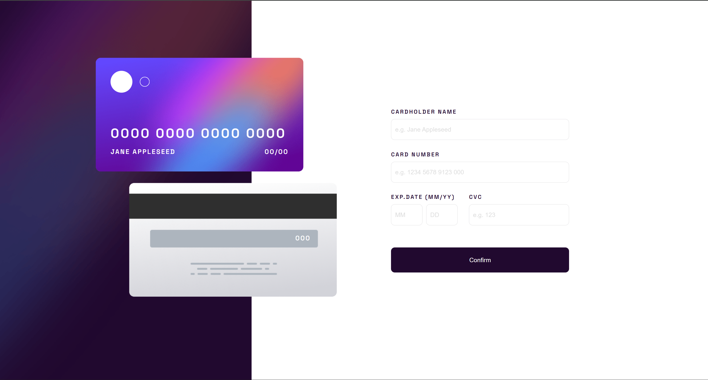

# Interactive Card Details Form



A responsive interactive card details form with real-time preview updates and client-side validation. Built as a Frontend Mentor challenge.

## Live Demo
https://interactive-card-details-form-beta-six.vercel.app/

## Repository
https://github.com/Ladipop/Interactive-Card-Details-Form

## Features
- Real-time card preview updates as the user types
- Form validation with clear error messages
- Success state shown on valid submission and reset on “Continue”
- Responsive layout for mobile and desktop
- Accessible inputs with labels and focus states

## Built With
- React (Create React App)
- Tailwind CSS
- JavaScript
- HTML5
- CSS3

## What I Learned
- Managing form state and validation in React
- Breaking UI into reusable components
- Handling responsive positioning for overlapping UI elements
- Improving user experience with instant visual feedback

## Run Locally

```bash
git clone https://github.com/Ladipop/Interactive-Card-Details-Form.git
cd Interactive-Card-Details-Form
npm install
npm start
